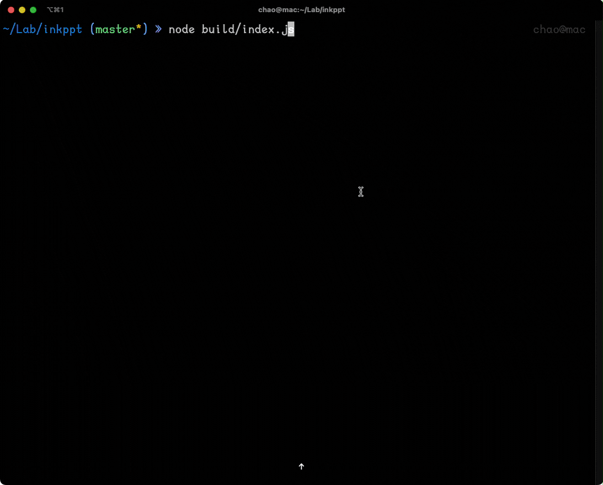

---
shiki:
  langs:
    - javascript
    - css
    - html
    - vue
    - markdown
    - typescript
    - jsx
    - tsx
    - bash
    - console
  themes:
    - github-dark
    - github-light
---

# inkppt 墨水 PPT

这是一个基于 [ink](https://github.com/vadimdemedes/ink) 开发的命令行工具, 他能够将 markdown 文件像 PPT 一样在终端渲染

## 

---

# 欢迎使用 [inkppt 墨水 PPT]

这是一个基于 [ink](https://github.com/vadimdemedes/ink) 开发的命令行工具

---

## Usage 使用方法

```bash
# 如果没有指定文件， 默认是 process.cwd()
# 如果是文件夹， 默认读取 /readme|home|index/i.md
# 如果没有上述文件，那么就读取 fs.readdirSync() 获取到的第一个md 文件
npx inkppt [path/of/file.md]
```

### 使用 `---` 作为分页标记,包含以下功能

- [x] 代码高亮
- [x] 键盘导航
- [x] **可执行**代码片段(js/ts/jsx/tsx)
- [x] 支持 Markdown metadata 配置

---

## 技术栈

表格也是支持的

| 仓库                                         | 功能               |
| -------------------------------------------- | ------------------ |
| [marked](https://github.com/markedjs/marked) | 解析 markdown 文件 |
| [chalk](https://github.com/chalk/chalk)      | 终端输出着色       |
| [shiki](https://github.com/shikijs/shiki)    | 代码高亮           |
| [tsx](https://github.com/esbuild-kit/tsx)    | 执行代码片段       |

---

## 图片/视频暂时还不支持奥


---

## 可执行代码片段, `ctrl` + `E`

```js
console.log("hello");
setTimeout(() => {
  console.log("say hi");
}, 200);
setTimeout(() => {
  throw new Error("SHOW ERROR");
}, 300);
```

---

## 快捷键

- 回到首页 `g` `g`
- 到最后一页 `G`
- 数字键 直接跳转到对应页面
- 后一页 `space` | `right` | `down` | `enter` | `n` | `j` | `l` | `Page Down`
- 前一页 `left` | `up` | `p` | `h` | `k` | `N` | `Page Up`

---

# Thanks

- Powered by [vadimdemedes/ink](https://github.com/vadimdemedes/ink)
- Inspired by [maaslalani/slides](https://github.com/maaslalani/slides)
- [mikaelbr/marked-terminal](https://github.com/mikaelbr/marked-terminal)
- [a20185/codechalk](https://github.com/a20185/codechalk)
