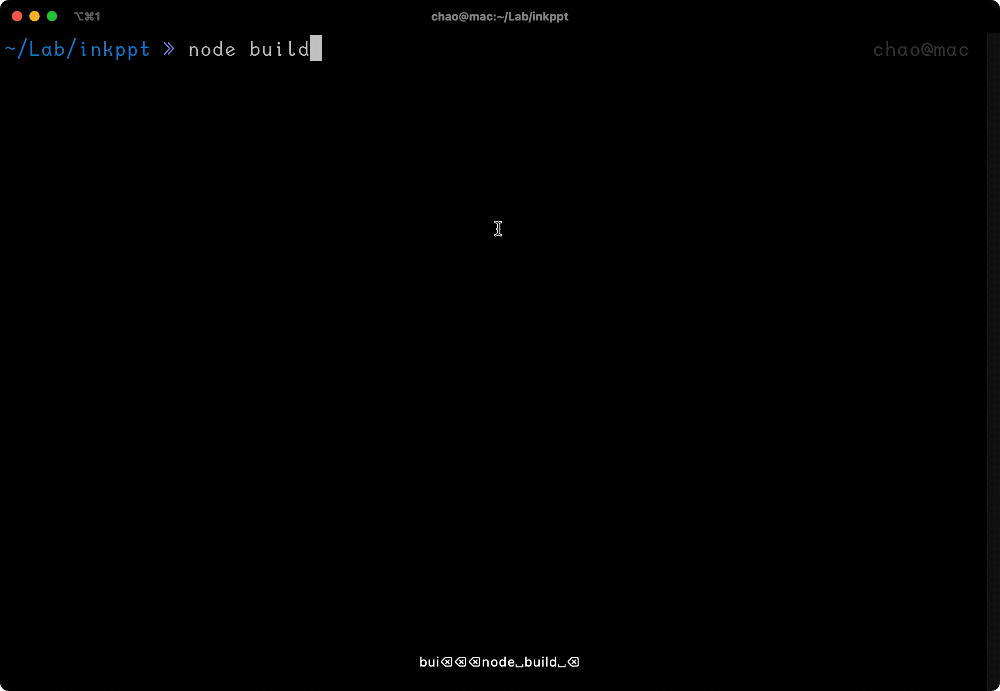

# inkppt



## Usage

```bash
npx inkppt path/of/file.md
```

A terminal based ppt like tool

# Welcome to inkppt

A terminal based ppt like tool

---

## Everything is markdown

In fact, this entire presentation is a markdown file.

---

## Everything happens in your terminal

Create slides and present them without ever leaving your terminal.

---

## Code execution

```js
console.log("hello");
setTimeout(() => {
  console.log("say hi");
}, 200);
```

You can execute code inside your slides by pressing \`<C-e>\`,
the output of your command will be displayed at the end of the current slide.

---

## Keybindings

Go to the first slide with the following key sequence:
* <kbd>g</kbd> <kbd>g</kbd>

Go to the next slide with any of the following key sequences:
<!-- * <kbd>space</kbd> -->
* <kbd>right</kbd>
* <kbd>down</kbd>
<!-- * <kbd>enter</kbd> -->
<!-- * <kbd>n</kbd> -->
<!-- * <kbd>j</kbd> -->
<!-- * <kbd>l</kbd> -->
* <kbd>Page Down</kbd>
<!-- * number + any of the above (go forward n slides) -->

Go to the previous slide with any of the following key sequences:
* <kbd>left</kbd>
* <kbd>up</kbd>
<!-- * <kbd>p</kbd> -->
<!-- * <kbd>h</kbd> -->
<!-- * <kbd>k</kbd> -->
<!-- * <kbd>N</kbd> -->
* <kbd>Page Up</kbd>
<!-- * number + any of the above (go back n slides) -->


# Thanks
- Powered by [vadimdemedes/ink](https://github.com/vadimdemedes/ink)
- Inspired by [maaslalani/slides](https://github.com/maaslalani/slides)
- [mikaelbr/marked-terminal](https://github.com/mikaelbr/marked-terminal)
- [codechalk](https://github.com/a20185/codechalk)
